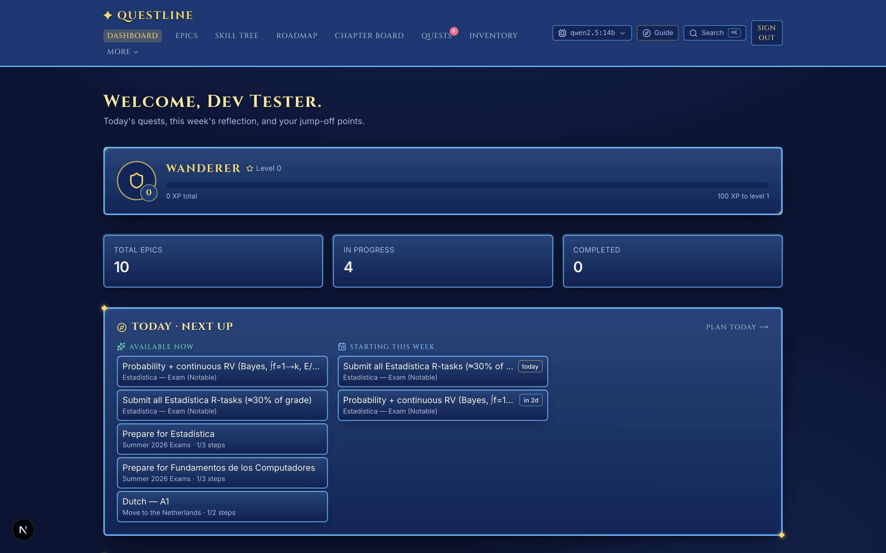
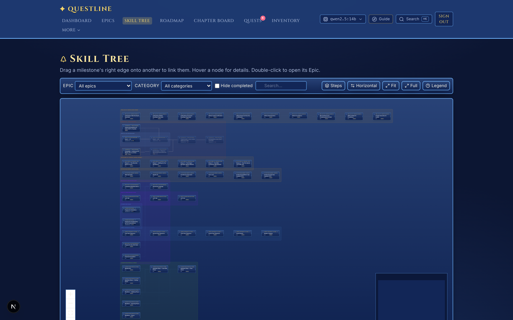
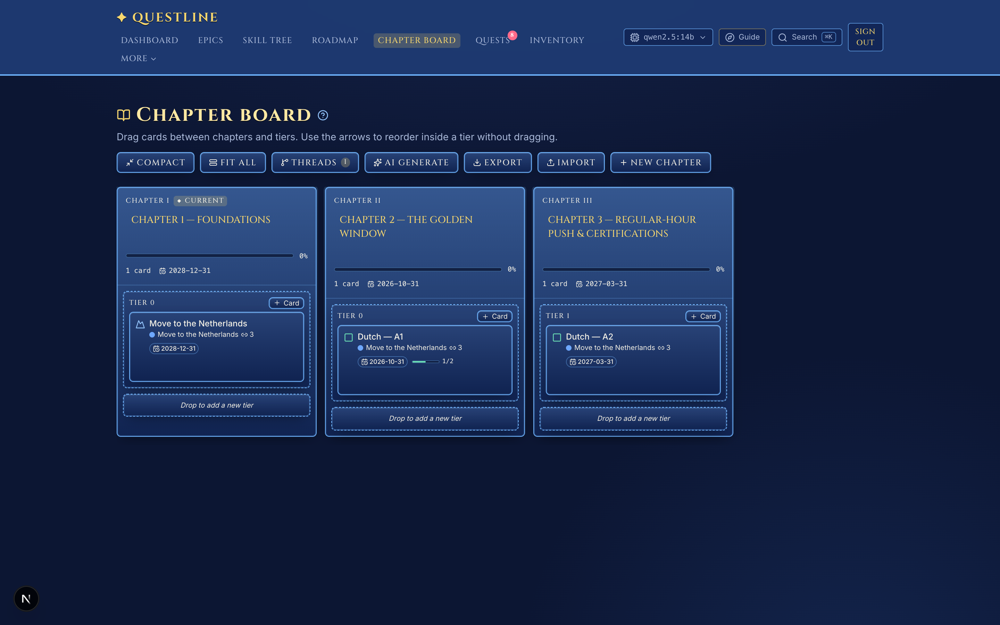
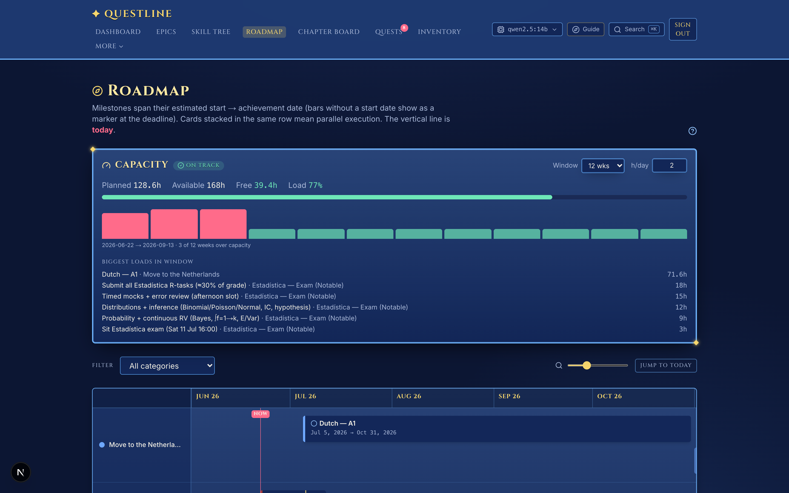
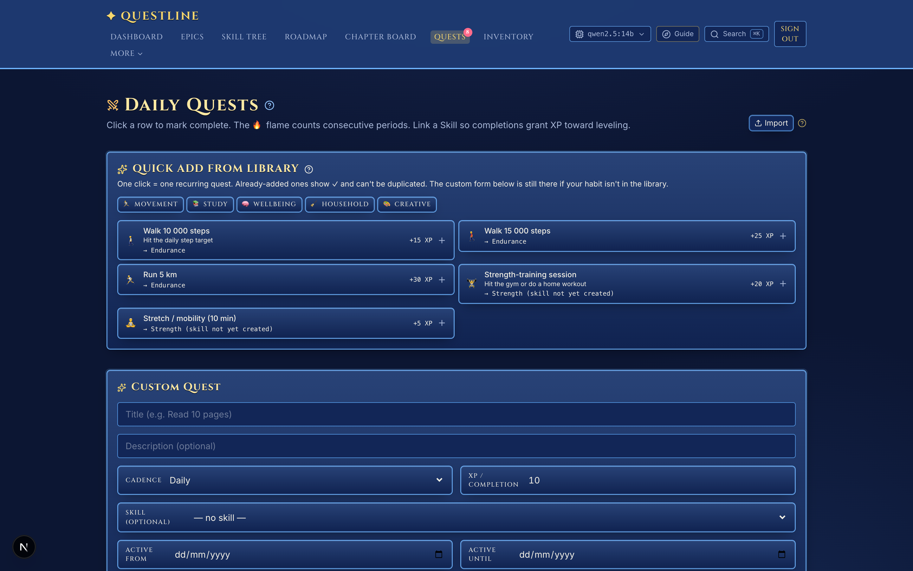
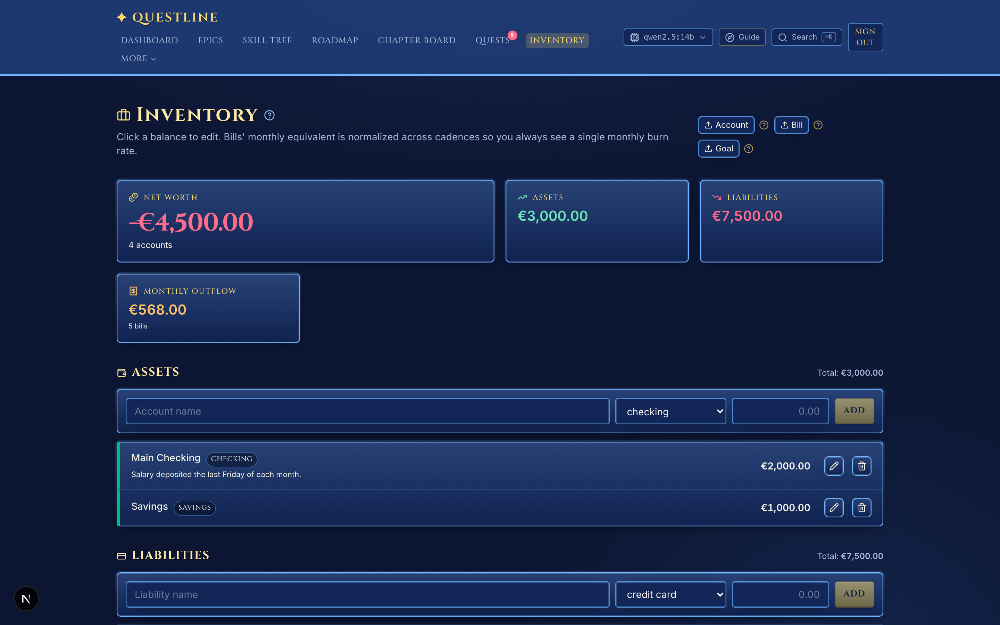

# ✦ Questline

> Turn your life goals into a JRPG. Plan ambitions as **Epics**, break them into
> **milestones** and **steps**, grind **daily quests**, watch a **skill tree**
> light up, and get advice from an **AI Guide that runs entirely on your own
> machine** — styled after the menus of *Trails in the Sky* and *Final Fantasy X*.

**100% local. No cloud, no accounts on someone else's server, no API keys, no
telemetry.** Your data lives in a file on your laptop and the AI runs on your
GPU. If Questline ever makes a network call to anything other than
`localhost`, that's a bug.

<p>
  
  
  
  
  
  
  
  
</p>

---

## Screenshots

> Trails-in-the-Sky / FFX-styled UI, shown with demo data.

|  |  |
|:--:|:--:|
| **Dashboard** — today's quests + next-up hub | **Skill Tree** — every milestone, auto-laid-out |
| [](docs/screenshots/dashboard.png) | [](docs/screenshots/skill-tree.png) |
| **Chapter Board** — plan the *order* you tackle goals | **Roadmap** — start→end bars, parallel tracks, capacity |
| [](docs/screenshots/chapter-board.png) | [](docs/screenshots/roadmap.png) |
| **Daily Quests** — habits with streaks + XP | **Inventory** — RPG-flavored finances |
| [](docs/screenshots/quests.png) | [](docs/screenshots/inventory.png) |

---

## Table of contents

- [Screenshots](#screenshots)
- [Why Questline](#why-questline)
- [Feature tour](#feature-tour)
- [The local AI](#the-local-ai)
- [Privacy](#privacy)
- [Run it](#run-it)
  - [Option A — Desktop app (recommended)](#option-a--desktop-app-recommended)
  - [Option B — Dev server](#option-b--dev-server)
- [Tech stack](#tech-stack)
- [Architecture](#architecture)
- [Data import / export](#data-import--export)
- [Scripts](#scripts)
- [Troubleshooting](#troubleshooting)
- [License](#license)

---

## Why Questline

Most goal apps are either a flat to-do list or a calendar. Real ambitions
aren't flat — "move to the Netherlands", "land a backend job", "pass the exam"
each fan out into prerequisites, parallel tracks, deadlines, habits, resources
and money. Questline models that structure as an RPG progression and makes the
*order* of attack the first-class thing you plan.

- **It's a structure, not a list.** Epics → Milestones → Steps, with real
  prerequisite edges that keep a milestone *locked* until what it depends on is
  done.
- **It's visual.** A skill tree, a roadmap timeline, and a chapter board so you
  can literally see the path and what unlocks next.
- **It's yours.** One on-device database, full JSON export/import of everything,
  one-click local backups. Nothing to subscribe to.
- **It has a coach in the box.** A local LLM (via Ollama) breaks down big goals,
  drafts your week, plans your day around your work hours, and chats over your
  actual roadmap — without a single byte leaving your machine.

---

## Feature tour

### 🗺️ Goal hierarchy with real prerequisites
- **Epics → Milestones → Steps**, plus **Resources** (books, courses, tools,
  links) and **Skills** attached to milestones.
- **Tiers** model parallelism: same tier = work that can happen in parallel,
  higher tier = later in the journey.
- **Polymorphic prerequisites** — a milestone can be gated by another milestone,
  a specific step, or a resource. Locked milestones stay locked (and visibly so)
  until their requirement is met.
- **Planning fields** — every milestone carries an estimated start date, target
  date, and rough effort (hours); steps carry effort in minutes. These power the
  roadmap bars and the capacity view.

### 🌳 Skill Tree
- Auto-laid-out graph (`@xyflow/react` + Dagre) of every milestone, grouped into
  per-epic clusters and colored by category.
- Nodes show status, deadline countdown, step progress and a "ready" badge when
  a milestone's prerequisites are all met.
- **Urgency states** — nodes shift in tone as a deadline approaches.
- Toolbar: filter by epic/category, search, toggle step/resource sub-nodes,
  switch layout direction (horizontal/vertical), fit-to-view, and fullscreen.
- Hover any node for a full detail card; double-click to jump to its Epic.

### ✨ Skill Constellation
- A second view of your **Skills** as a constellation graph with prerequisite
  edges (e.g. *Kana → Kanji → Reading*).
- Skills earn **XP and levels** as the milestones and quests linked to them
  complete. Cycle-safe link planner; optional AI link suggestions.

### 📅 Roadmap
- Global timeline with **real start → end milestone bars**, parallel-execution
  tracks, sticky epic labels, and a category filter.
- Dedicated **per-category roadmap** at `/roadmap/[categoryId]`.
- **Capacity view** — compares available goal-hours in a window against
  pro-rated planned effort, so you can see when you've over-committed (undated
  work is kept separate instead of distorting the numbers).

### 📖 Chapter Board
- A JRPG "chapter select" board: arrange your Epics, Milestones and Quests into
  **Chapters** (phases) and **tiers** to plan the *order* you tackle everything.
- Drag cards between chapters/tiers, or reorder with the keyboard.
- **Threads** overlay draws connectors linking an epic's cards across chapters.
- **Compact / Fit-all** density controls, a Diablo-style hover detail card,
  click-a-card-to-open-its-entity, and per-chapter progress rings + date spans.
- **AI Generate** proposes a starter chapter layout from your goals; full
  JSON import/export of the board.

### ⚔️ Daily Quests, Side Quests & Notice Board
- **Recurring habits** (daily/weekly) with streaks, XP, optional times-per-period
  targets (e.g. gym 4×/week), and start/end windows.
- **Side quests** — one-off tasks with difficulty (trivial/normal/hard), XP and
  optional expiry, on a **Notice Board**.
- Quick-add library of common habits; the AI Guide can generate side quests on
  demand.

### ⏱️ Focus Sessions
- A built-in deep-work timer that logs sessions and awards XP — turn study/work
  blocks into measurable progress.

### 📔 Daily Journal
- Plan a day as a timeline. A **deterministic day planner** packs your tasks
  around fixed anchors and your real working hours.
- **Schedule profiles** define your work window (e.g. 08:00–18:00) with a
  mid-day **break** (lunch); supports seasonal profiles (regular vs. summer
  hours) with effective-from/to dates and priorities.
- Optional **"Optimize with AI"** pass refines the plan; "Copy yesterday" reuses
  a good day.

### 📊 Chronicle
- Stats and streak analytics over your history — momentum at a glance.

### 🏆 Trophy Room
- Completed Epics earn a **deterministic SVG sigil** (same epic → same crest).
  Exportable as JSON.

### 🤖 The AI Guide (local, on-device)
- **Ask the Guide** — chat over your *actual* roadmap data.
- **Break down an Epic** into proposed milestones you review and accept.
- **Weekly Coach** — a short briefing of priorities, risks and encouragement.
- **Save Point** — drafts a weekly retrospective.
- **Schedule advice** and **resource recommendations**.
- **Per-surface model routing** — pick which local model powers each surface
  (chat, breakdown, board, day plan, …) or let **Auto** choose; a live
  tokens/sec + model badge keeps it transparent. Heavy models are evicted from
  RAM right after one-shot tasks so they don't sit pinned.

### 🧠 Notes → app pipeline
- Paste messy bullet-point goals and let a local model **restructure → serialize
  → validate** them into Questline's import format, with an auto-fix step that
  feeds Zod validation errors back to the model. Review the full hierarchy
  before committing.

### 🗓️ Calendar (two-way `.ics`)
- **Subscribe** in Apple/Google/Outlook Calendar via a per-user secret feed URL
  (rotatable). Milestone deadlines, quests and **step time-blocks** show up on
  your calendar.
- **Import** external `.ics` files and pick exactly which events to bring in.
- Build **on-demand export bundles**, choosing which Questline events to include.

### 💾 Backup, restore & portability
- **Full JSON export/import** of every entity — Categories, Skills, Epics,
  Milestones, Quests, Accounts, Bills, Goals — and the whole Profile.
- **WorkspaceBundle** packages a Profile *and* a Chapter Board together; plan
  from **Markdown** and round-trip back to Markdown.
- Stable **keys** make re-import idempotent (update-in-place, no duplicates).
- One-click **local backups** (kept to a rolling history) + daily auto-backup,
  and a guarded **Restart Game** with snapshot-based undo.
- Every entity ships a `(?)` helper with an example payload and a
  "copy as LLM prompt" button.

### 💰 Inventory (RPG-flavored finances)
- Accounts (assets + liabilities), recurring bills, and savings goals with a
  net-worth summary. Stored as **integer cents** — no floating-point drift.
  *(Finance is fully optional.)*

### 🎛️ Quality-of-life
- **Command palette** (⌘K) to jump anywhere.
- **Player level + XP** with level-up feedback; a hero panel on the dashboard.
- **Notifications** (native desktop / Web Notifications) for a daily digest,
  milestone-deadline lead time and bill-due lead time.
- **Onboarding tutorial** (Avatar → first Quest → first Epic).
- Accessibility pass: reduced-motion support, focus states, ARIA; mobile nav.

---

## The local AI

Questline's "Guide" is an [Ollama](https://ollama.com) model running on your
machine. There is **no remote inference** and **no API key**.

- **Default model:** `qwen2.5:14b` — a strong fit for ~24 GB Apple Silicon
  (good tool-calling + JSON fidelity). Lighter option: `qwen2.5:7b` (~4.7 GB).
- The app **lazily loads** the model on first use and lets it unload on idle, so
  it doesn't pin gigabytes of RAM just because the app is open.
- Everything degrades gracefully: if Ollama isn't running, only the AI features
  are unavailable — the rest of the app works perfectly, and a banner tells you
  how to start it.

```bash
brew install --cask ollama   # menu-bar app, auto-starts
ollama pull qwen2.5:14b      # one-time, ~9 GB
```

---

## Privacy

A short list of things Questline **never** does:

- ☒ Talk to the cloud (no OpenAI, no Anthropic, no Google, no Apple)
- ☒ Send telemetry or analytics
- ☒ Authenticate through third-party OAuth
- ☒ Sync to any remote service

What it **does** do, all on your machine:

- ☑ Stores data in an embedded database file (desktop) or local Postgres (dev)
- ☑ Runs the AI via Ollama on `localhost:11434`
- ☑ Serves the UI from a local Next.js server

---

## Run it

There are two ways to run Questline.

### Option A — Desktop app (recommended)

A normal double-click macOS app. **No terminal, no Docker, no database server**
to manage — the database is embedded as a file ([PGlite](https://pglite.dev))
and migrations apply automatically on first launch. Your data is stored in the
app's user-data folder and survives reinstalls.

```bash
pnpm install
pnpm app:dist        # → dist-app/Questline-<version>-arm64.dmg
```

Open the `.dmg`, drag Questline to Applications, launch it. Install
[Ollama](https://ollama.com) separately if you want the AI Guide.

> Targets Apple Silicon (arm64). See [`DESKTOP_APP.md`](DESKTOP_APP.md) for how
> the Electron shell wraps the Next.js production server.

### Option B — Dev server

For development / hacking on the code, with Postgres in Docker:

```bash
# 1. Database — Postgres (via OrbStack or Docker Desktop)
pnpm db:up                       # docker compose up -d (Postgres 16 + pgvector)

# 2. Dependencies
pnpm install

# 3. Env — copy the template (defaults are local-only)
cp .env.example .env.local
#   generate a real auth secret:
#   openssl rand -base64 32   →  BETTER_AUTH_SECRET

# 4. Schema
pnpm db:migrate

# 5. (optional) Local AI
ollama pull qwen2.5:14b

# 6. Run
pnpm dev
open http://localhost:3000
```

First sign-up runs a three-step tutorial, then drops you on the Dashboard.

> **Requirements:** Node 20+, [pnpm](https://pnpm.io), and (for Option B) Docker
> via [OrbStack](https://orbstack.dev) or Docker Desktop. Ollama is optional and
> only needed for AI features.

---

## Tech stack

| Layer | Choice |
|---|---|
| Framework | **Next.js 16** (App Router, Turbopack) + **React 19** + TypeScript (strict) |
| API | **tRPC v11** — end-to-end typed RPC |
| ORM | **Drizzle ORM** + drizzle-kit migrations |
| Database | **PGlite** (embedded file, desktop) · **PostgreSQL 16 + pgvector** (dev, Docker) |
| Auth | **Better Auth** — email + password, fully local |
| Desktop | **Electron** shell + `electron-builder` (.dmg) |
| Styling | **Tailwind CSS v4** — custom *Trails / FFX* palette, Cinzel headings, Inter body |
| Graphs | `@xyflow/react` + `@dagrejs/dagre` |
| AI | **Ollama** (on-device LLM, default `qwen2.5:14b`) |
| Calendar | hand-rolled **RFC 5545** `.ics` builder + parser |
| Tests | **Vitest** (pure-lib units + PGlite-backed integration) |

---

## Architecture

```
src/
├── app/
│   ├── (app)/                  authenticated pages
│   │   ├── dashboard/          today + next-up hub, hero panel, weekly coach
│   │   ├── epics/[id]/         epic detail, milestone CRUD, AI break-down
│   │   ├── tree/               React-Flow skill tree
│   │   ├── skills/             skill list + constellation graph
│   │   ├── roadmap/            global + per-category timeline + capacity
│   │   ├── board/              JRPG chapter board
│   │   ├── quests/             daily / weekly habits
│   │   ├── notice-board/       one-off side quests
│   │   ├── journal/            daily planner (deterministic + AI)
│   │   ├── focus/              deep-work timer
│   │   ├── chronicle/          stats + streaks
│   │   ├── inventory/          finance dashboard
│   │   ├── calendar/           subscription + import/export
│   │   ├── trophy-room/        completed-epic sigils
│   │   ├── profile/            backup / restore + preferences
│   │   └── ai/                 notes → structured → JSON pipeline
│   └── api/                    .ics feeds, AI SSE streams, health probes
├── components/                 UI: dialogs, board, tree nodes, cards …
├── lib/                        advisor (AI), ollama, ics(+parser), urgency,
│                               schedule, capacity, day-plan, trophy,
│                               json-shapes (Zod + examples), example-profile …
└── server/
    ├── auth.ts                 Better Auth
    ├── db/schema/              Drizzle schemas
    └── trpc/routers/           tRPC routers (one per domain)
```

Drizzle migrations live in [`/drizzle`](drizzle) and are applied automatically
in the desktop build (or via `pnpm db:migrate` in dev). Poke around the schema
with `pnpm db:studio`.

---

## Data import / export

Everything in Questline is portable JSON, validated with Zod on the way in:

- **Per-entity** export/import on each page (Category, Skill, Epic, Quest, …).
- **Profile** — your entire roadmap as one object.
- **WorkspaceBundle** — Profile + Chapter Board together.
- **Markdown** — generate a plan from Markdown and round-trip back out.
- **AI assist** — paste raw notes and let a local model turn them into a valid
  import, with a Zod-error-driven auto-fix loop.

Stable `key` slugs make re-imports **idempotent** (update-in-place, no
duplicates), so you can keep a plan in version control and re-import safely.

---

## Scripts

```bash
pnpm dev                 # Next.js dev server
pnpm build               # production build
pnpm test                # Vitest (unit + integration)
pnpm tsc --noEmit        # type-check the whole codebase

pnpm db:up               # start Postgres (Docker) — dev only
pnpm db:down             # stop it
pnpm db:generate         # author a new Drizzle migration
pnpm db:migrate          # apply pending migrations
pnpm db:studio           # Drizzle's web inspector

pnpm app:dev             # run the Electron shell against a build
pnpm app:dist            # build the macOS .dmg
```

---

## Troubleshooting

| Symptom | Fix |
|---|---|
| **"Can't reach Ollama"** | Start the daemon: open the Ollama menu-bar app or run `ollama serve`. Only AI features need it. |
| **"Model not found"** | `ollama pull qwen2.5:14b` (the app surfaces this prompt automatically). |
| **AI returns garbled / empty results** | Use a capable model. Sub-7B models struggle with structured output; the default `qwen2.5:14b` (or `qwen2.5:7b`) is recommended. |
| **Postgres "connection refused" (dev)** | Docker isn't up — `pnpm db:up` (start OrbStack/Docker Desktop first). |
| **Want to start fresh** | Profile → **Restart Game** (snapshot-backed, undoable), or restore a JSON backup. |

---

## License

Personal project by **[@fabianluz](https://github.com/fabianluz)**. Add a
`LICENSE` file if you want to set explicit reuse terms.

<sub>Built with a lot of love for JRPG menus. Plan boldly. ✦</sub>
